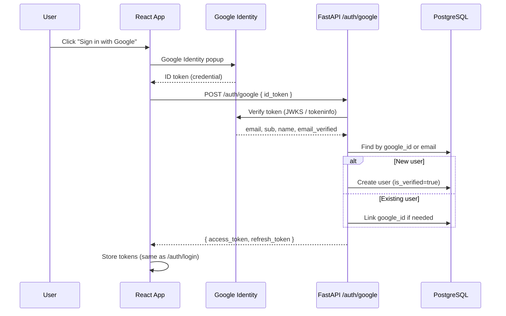

# Google Login — Implementation Plan

Plan for adding Google Sign-In to the RAG Knowledge Engine. Review the decisions in **Section 3** before implementation.

---

## 1. Goal

Add Google as a sign-in option alongside existing email/password auth. After Google login, the user receives the same JWT pair the app already uses — no changes to refresh, logout, or protected API calls.

**Recommended approach:** Frontend obtains a Google ID token → backend verifies it → issues existing tokens.

This fits the React SPA described in `auth.md` and avoids server-side redirect/cookie complexity.

---

## 2. Architecture



**Unchanged after login:** `/auth/refresh`, `/auth/logout`, `Authorization: Bearer …` on all protected routes.

---

## 3. Decisions for Review

| # | Decision | Recommendation | Alternative |
|---|----------|----------------|-------------|
| 1 | OAuth flow | **ID token via POST** | Full redirect flow (`GET /auth/google/login`) |
| 2 | Account linking | **Link by email** — if email exists, attach `google_id` | Reject with 409 if email already registered |
| 3 | Password for Google users | **`hashed_password` nullable** | Store random unusable password |
| 4 | Email verification | **Skip for Google** (`is_verified=True`) | Require verification for all |
| 5 | Username for new Google users | **Auto-generate** from email prefix + suffix if taken | Let user pick username on first login |
| 6 | Google-only login blocking password login | Allow password login only if user has a password | Force password setup after Google sign-in |

**Suggested defaults:** rows 1–5 as recommended; row 6 — Google-only users cannot use `/auth/login` with password (return clear error: "Use Google sign-in").

---

## 4. Backend Changes

### 4.1 New dependency

Add to `requirements.txt`:

```
google-auth>=2.29.0
httpx>=0.27.0   # if not already transitive
```

Use `google.oauth2.id_token.verify_oauth2_token()` — no new OAuth server library needed for the ID-token flow.

### 4.2 Environment variables

Add to `Settings` (`src/helpers/config.py`) and `.env.example`:

```env
GOOGLE_CLIENT_ID="your-client-id.apps.googleusercontent.com"
# GOOGLE_CLIENT_SECRET not required for ID-token-only flow
```

### 4.3 Database migration

New Alembic revision after `a1f7c2d9e8b3`:

| Column | Type | Notes |
|--------|------|-------|
| `google_id` | `String(255)`, unique, nullable | Google's `sub` claim |
| `hashed_password` | make **nullable** | Existing rows unchanged |
| `auth_provider` | `String(20)`, default `"local"` | Optional but useful: `"local"`, `"google"`, `"both"` |

**Indexes:** unique index on `google_id` (partial: where not null).

### 4.4 User model (`src/models/user_model.py`)

- `hashed_password: Mapped[str | None]`
- `google_id: Mapped[str | None]`
- Optional: `auth_provider: Mapped[str]`

### 4.5 New helper — `src/helpers/google_auth.py`

Responsibilities:

1. Verify ID token against `GOOGLE_CLIENT_ID`
2. Extract: `sub`, `email`, `email_verified`, `name`
3. Reject if `email_verified` is false
4. Return typed result or raise `HTTPException(401)`

### 4.6 Auth controller changes (`src/controllers/auth_controller.py`)

**New method:** `google_login(id_token, db, settings)`

Logic:

```
1. Verify token → get google_id, email, name
2. user = find by google_id
3. if not user:
     user = find by email
     if user:
       if user.google_id and user.google_id != google_id → 409
       else → link: set google_id, auth_provider="both", is_verified=True
     else:
       → create user with generated username, google_id, no password, is_verified=True
4. Issue access_token + refresh_token (reuse _new_refresh_token)
5. Return TokenResponse
```

**Update existing `login`:**

```python
if not user.hashed_password:
    raise HTTPException(403, "This account uses Google sign-in")
```

Guard `verify_password` so it is never called with a null password.

**Extract shared helper:** `_issue_tokens(user, db, settings)` — used by both `login` and `google_login` to avoid duplication.

### 4.7 Schema (`src/schemas/auth.py`)

```python
class GoogleLoginRequest(BaseModel):
    id_token: str = Field(min_length=100)
```

### 4.8 Route (`src/routes/auth_router.py`)

```python
POST /auth/google  →  TokenResponse
```

No changes to other auth routes.

### 4.9 Documentation

Update `auth.md` with:

- Google button setup (`@react-oauth/google`)
- New endpoint contract
- Env var `VITE_GOOGLE_CLIENT_ID`

---

## 5. Frontend Changes (React — separate repo)

Per `auth.md`, add:

| File | Change |
|------|--------|
| `.env` | `VITE_GOOGLE_CLIENT_ID=...` |
| `Login.tsx` | Google Sign-In button |
| `api/auth.ts` | `googleLogin(idToken)` → `POST /auth/google` |
| `AuthContext.tsx` | `loginWithGoogle(idToken)` method |

**Library:** `@react-oauth/google` with `<GoogleLogin onSuccess={...} />`.

On success:

```ts
const credential = response.credential; // ID token
await authApi.googleLogin(credential);
// same token storage as email login
```

**UX:**

- Show Google button below email/password form
- Handle 409: "An account with this email already exists. Sign in with password first, then link Google in settings." (linking UI can be phase 2)
- Handle 401: invalid/expired Google token

---

## 6. Google Cloud Console Setup

1. [Google Cloud Console](https://console.cloud.google.com/) → APIs & Services → Credentials
2. Create **OAuth 2.0 Client ID** → type **Web application**
3. **Authorized JavaScript origins:**
   - `http://localhost:5173` (dev)
   - `https://your-production-domain.com`
4. **Authorized redirect URIs:** not required for popup/One Tap ID-token flow, but add callback URL if you later switch flows
5. Copy **Client ID** → backend `GOOGLE_CLIENT_ID` and frontend `VITE_GOOGLE_CLIENT_ID`
6. Configure **OAuth consent screen** (app name, support email, scopes: `email`, `profile`, `openid`)

---

## 7. Security Checklist

- Verify token **server-side** — never trust client-decoded claims alone
- Check `email_verified` from Google
- Validate `aud` matches `GOOGLE_CLIENT_ID`
- Reject expired tokens (library handles this)
- Do not expose `GOOGLE_CLIENT_SECRET` to frontend (not needed for this flow)
- Rate-limit `/auth/google` if you add rate limiting elsewhere

---

## 8. Edge Cases

| Scenario | Behavior |
|----------|----------|
| New Google user | Create account, skip email verification |
| Email exists (password account) | Link `google_id`, set `auth_provider="both"` |
| Email exists, different `google_id` already linked | 409 Conflict |
| Google user tries password login | 403 with message to use Google |
| Password user later uses Google (same email) | Auto-link, both methods work |
| Username collision on signup | Append random suffix (`jane`, `jane_4821`) |

---

## 9. Testing Plan

**Backend unit/integration tests:**

- Valid Google token → new user created, tokens returned
- Valid token, existing email → account linked
- Invalid/expired token → 401
- Unverified Google email → 401
- Google-only user → password login returns 403

**Manual QA:**

1. Register with email/password → verify email → login works
2. Same email via Google → links, both login methods work
3. Google-only new user → login, access protected routes
4. Refresh/logout unchanged

**Mocking:** Use a test fixture or mock `verify_oauth2_token` in tests — do not call Google in CI.

---

## 10. Implementation Phases

### Phase 1 — Backend (this repo) ~2–3 hours

- Migration + model changes
- `google_auth` helper
- `POST /auth/google`
- Update `login` null-password guard
- `.env.example` + tests

### Phase 2 — Frontend (React repo) ~1–2 hours

- Google button on login page
- Wire to `/auth/google`
- Error handling

### Phase 3 — Optional follow-ups

- Settings page: "Link Google account" / "Unlink"
- Account deletion handling for OAuth users
- Apple/GitHub OAuth (same pattern)

---

## 11. Files Touched (Backend)

| File | Action |
|------|--------|
| `requirements.txt` | Add `google-auth` |
| `src/helpers/config.py` | Add `GOOGLE_CLIENT_ID` |
| `src/.env.example` | Document new var |
| `src/helpers/google_auth.py` | **New** |
| `src/models/user_model.py` | Nullable password, `google_id` |
| `alembic/versions/..._add_google_auth.py` | **New** migration |
| `src/controllers/auth_controller.py` | `google_login`, refactor token issuance |
| `src/schemas/auth.py` | `GoogleLoginRequest` |
| `src/routes/auth_router.py` | New route |
| `auth.md` | Document Google flow |

---

## 12. Open Questions

Confirm before implementation:

1. **Account linking policy** — auto-link by email (recommended) or require password login first?
2. **Username UX** — auto-generate silently, or prompt user on first Google sign-in?
3. **Phase scope** — backend only first, or backend + frontend together?
4. **Frontend location** — is the React app in a separate repo? (Plan assumes yes, per `auth.md`.)

---

## 13. API Reference (planned)

### POST /auth/google

Request:

```json
{
  "id_token": "eyJhbGciOiJSUzI1NiIs..."
}
```

Success response (same as `/auth/login`):

```json
{
  "access_token": "...",
  "refresh_token": "...",
  "token_type": "bearer"
}
```

Error responses:

| Status | Detail |
|--------|--------|
| 401 | Invalid or expired Google token |
| 403 | Google email not verified |
| 409 | Email linked to a different Google account |
